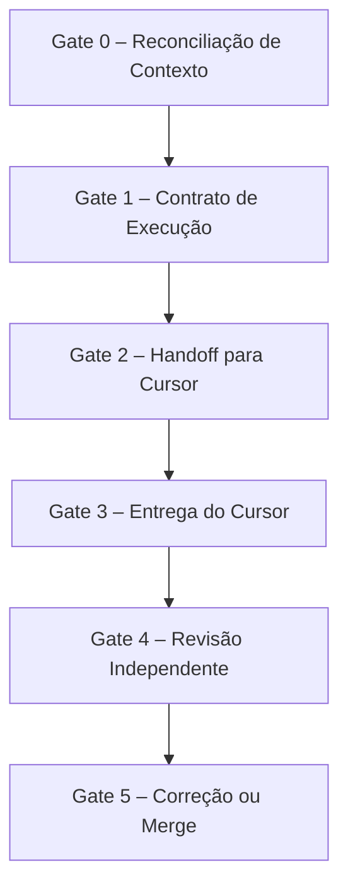

# Fluxo de Integração do Grok Mem

Este documento detalha o **processo de seis gates** que garante a integração segura e verificável do módulo de memória operacional **Grok Mem** (anteriormente `claude‑mem`).

## Gate 0 – Reconciliação de Contexto
- **Objetivo**: Unificar informações de *Notion*, *GitHub Issues/PRs* e *Grok Mem*.
- **Ações**:
  1. Extrair backlog e decisões de produto de Notion via API.
  2. Listar PRs/Issues aberto(s) e seu estado atual.
  3. Consultar registros recentes de *operational memory* (`operationalMemory.queryRecent()`).
  4. Classificar cada item como **Concluído**, **Pendente**, **Depreciado**, **Parcialmente entregue** ou **Sem evidência**.

## Gate 1 – Contrato de Execução
- **Objetivo**: Criar/atualizar uma *issue* que descreve o escopo, critérios de aceitação, riscos e testes necessários.
- **Formato da issue** (exemplo):
  - Título: `feat(grok-mem): integrar memória operacional ao fluxo`
  - Descrição: resumo do objetivo, diagramas, links para Notion e tickets relacionados.
  - Checklist: `[] Validação de privacidade`, `[] Testes unitários`, `[] E2E`, `[] Atualizar GOLDEN_RULES`.

## Gate 2 – Handoff para Cursor
- **Objetivo**: Passar a tarefa priorizada ao agente **Cursor** com contexto validado.
- **Passagem de dados**:
  - `recordStep` em Grok Mem registra: *tarefaId, escopo, limites, requisitos de teste*.
  - Cursor recebe um **prompt** contendo o conteúdo da issue e o “contract”.

## Gate 3 – Entrega do Cursor
- **Objetivo**: O Cursor gera um **PR pequeno** (≤ 300 linhas), com:
  - Descrição detalhada das mudanças.
  - Evidência de testes (unitários, integração, E2E).
  - Lista de pendências declaradas.
- **Validação automática**: CI roda `npm run check-health` e verifica cobertura mínima.

## Gate 4 – Revisão Independente
- **Quem revisa?** Você, como revisor independente, verifica:
  - Conformidade com as **Golden Rules** (incluindo a nova Regra 6 de privacidade).
  - Segurança, auditoria, persistência, rate‑limiting.
  - Cobertura de testes e ausência de dependências mock sem sinalização.

## Gate 5 – Correção ou Merge
- **Se houver bloqueios**: o autor (Cursor) corrige e reabre o PR.
- **Quando aprovado**: merge na branch feature, `git push`, e atualização da issue.
- **Persistência**: `operationalMemory.recordStep` salva a decisão final e o hash do commit.

---

## Observação sobre privacidade
Qualquer dado sensível armazenado ou enviado por Grok Mem deve ser envolto em marcadores `<private>` para que o **observer** hospedado não vaze informações a terceiros.

## Próximos passos
1. Implementar o módulo `src/memory/operationalMemory.ts` com as APIs `recordStep` e `queryRecent`.
2. Adicionar scripts de CI que verifiquem a presença de `<private>` nos payloads externos.
3. Atualizar o `README.md` com o diagrama acima e instruções de uso.
